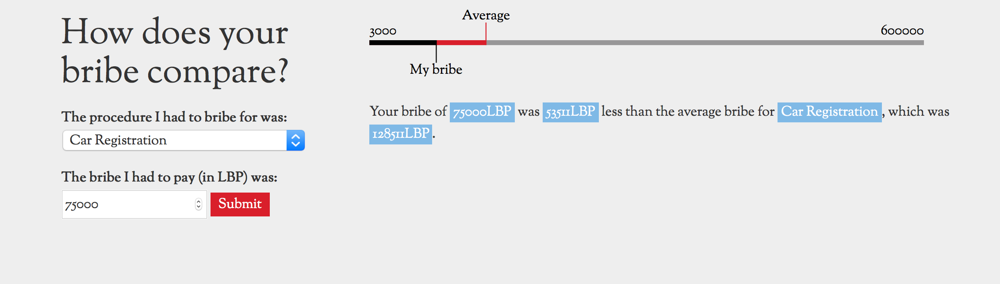

# How does your bribe compare?
*Companion piece to <a href="http://radiocontrolled.github.io/cradleToGrave">From cradle to grave: a Lebanese life in bribes</a>*

## <a href="http://radiocontrolled.github.io/bribeLookup">Demo</a>

This tool is based on data collected by Sakker el Dekkene (SED), a Lebanese non governmental organisation which documents corruption in Lebanon and publicises its consequences to everyday Lebanese. One of SED's key activities is collecting and analysing reports of bribery from the Lebanese public. 
 
 

 
 

## The Data
https://docs.google.com/spreadsheets/d/1xxfpA7qNZH7URp-wGO2iPAZaNzcvFvOXjmF0LK4Lji4/pubhtml

### To-do
* highlight bug if equal amount
* share button?
